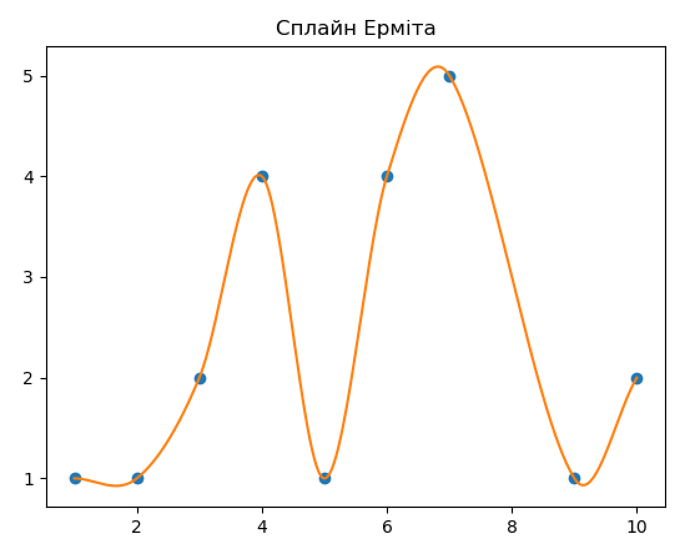
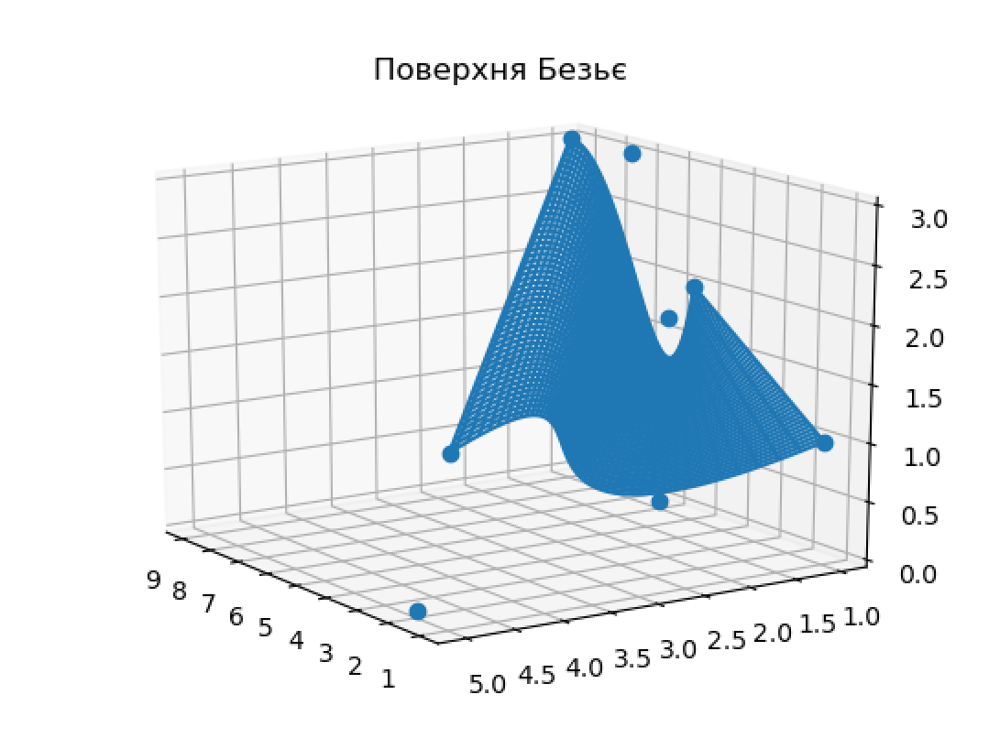

# Модульна контрольна робота 2
### З Математичних Основ Обчислювальної Геометрії
### Студента групи ІПС-31
### Точаненка Владислава Володимировича
### Варіант 14

# Завдання 1
Для заданої множини контрольних точок  на площині : `(1;1)`, `(2;1)`, `(3;2)`, `(4;4)`, `(5;1)`, `(6;4)`, `(7;5)`, `(9;1)`, `(10;2)` побудувати сплайн Ерміта.

### Візуалізація



### Реалізація

Задаємо початкові точки та сортуємо їх спочатку за першою, а потім за другою координатами:

```python
points = [
    [1.0, 1.0],
    [2.0, 1.0],
    [3.0, 2.0],
    [4.0, 4.0],
    [5.0, 1.0],
    [6.0, 4.0],
    [7.0, 5.0],
    [9.0, 1.0],
    [10.0, 2.0]
]
points.sort()
```

Додаємо початкові точки до графіку:

```python
plot.plot([p[0] for p in points], [p[1] for p in points], 'o')
```

Знаходимо різниці для кожного з проміжків:

```python
# Diference for each line
def grad(idx1, idx2): return (
    self.KeyPts[idx2].X - self.KeyPts[idx1].X) / (self.KeyPts[idx2].T - self.KeyPts[idx1].T)

for idx in range(1, len(self.KeyPts)-1):
    self.KeyPts[idx].M = grad(idx - 1, idx + 1)

self.KeyPts[0].M = grad(0, 1)
self.KeyPts[-1].M = grad(-2, -1)
```

Тут використовуємо таку формулу для визначення різниць:

\frac{\boldsymbol{p}_{k&plus;1}-\boldsymbol{p}_{k-1}}{2})

Далі знаходимо базові ермітові поліноми за такими формулами:

&space;&&space;=&space;&&space;2t^3-3t^2&plus;1&space;&&space;=&space;&(&space;1&space;-&space;t)^2&space;(1&space;&plus;&space;2&space;t))

&space;&&space;=&space;&&space;-2t^3&plus;3t^2&space;&&space;=&space;&&space;t^2&space;(3&space;-&space;2&space;t))

&space;&&space;=&space;&&space;t^3-2t^2&plus;t&space;&&space;=&space;&&space;t&space;(&space;1&space;-&space;t)^2)

&space;&&space;=&space;&&space;t^3-t^2&space;&&space;=&space;&&space;t^2&space;(t&space;-&space;1))

```python
def h00(t): return t * t * (2.0 * t - 3.0) + 1.0
def h10(t): return t * (t * (t - 2.0) + 1.0)
def h01(t): return t * t * (-2.0 * t + 3.0)
def h11(t): return t * t * (t - 1.0)
```

Та увесь поліном як комбінація чотирьох базових:

&space;=&space;h_{00}(t)\mathbf{p_0}&space;&plus;&space;h_{10}(t)\mathbf{m_0}&space;&plus;&space;h_{01}(t)\mathbf{p_1}&space;&plus;&space;h_{11}(t)\mathbf{m_1})

```python
h00(tr) * p0.X + h10(tr) * (p1.T - p0.T) * p0.M + h01(tr) * p1.X + h11(tr) * (p1.T - p0.T) * p1.M
```

Будуємо отриманий сплайн на графіку:

```python
X = []
Y = []
for t in np.arange(points[0][0], points[-1][0], 0.001):
    x = spline.Evaluate(t)
    X.append(t)
    Y.append(x)

plot.title("Сплайн Ерміта")

plot.plot(X, Y)
plot.show()
```

# Завдання 2
Для заданої множини контрольних точок у просторі: `(1;1;1)`, `(2;5;0)`, `(3;2;2)`, `(4;4;1)`, `(5;1;2)`, `(6;1;0)`, `(7;1;3)`, `(9;1;3)` Побудувати поверхню Безьє.

### Візуалізація



### Реалізація

Задаємо початкові точки:

```python
points = [
    [1.0, 1.0, 1.0],
    [2.0, 5.0, 0.0],
    [3.0, 2.0, 2.0],
    [4.0, 4.0, 1.0],
    [5.0, 1.0, 2.0],
    [6.0, 1.0, 0.0],
    [7.0, 1.0, 3.0],
    [9.0, 1.0, 3.0]
]
```

Розкидаємо їх у масиви по 2 масиви по 4 елементи у кожному. Створюємо списки координат із деяким проміжком.

```python
x_points = np.array([
    [points[0][0], points[1][0], points[2][0], points[3][0]],
    [points[4][0], points[5][0], points[6][0], points[7][0]]
])
y_points = np.array([
    [points[0][1], points[1][1], points[2][1], points[3][1]],
    [points[4][1], points[5][1], points[6][1], points[7][1]]
])
z_points = np.array([
    [points[0][2], points[1][2], points[2][2], points[3][2]],
    [points[4][2], points[5][2], points[6][2], points[7][2]]
])

# Parameter space distribution
u_vector = np.linspace(0, 1.0, num = 100)
v_vector = np.linspace(0, 1.0, num = 100)
```

Будуємо матриці Бернштейна. Для двовимірного випадку формула виглядає так:

=\sum&space;_{{i=0}}^{n}\sum&space;_{{j=0}}^{m}B_{i}^{n}(u)\;B_{j}^{m}(v)\;{\mathbf&space;{P}}_{{i,j}})

А поліноми Берштейна обчислюються так:

={n&space;\choose&space;i}\;u^{i}(1-u)^{{n-i}}={\frac&space;{n!}{i!(n-i)!}}\;u^{i}(1-u)^{{n-i}})

```python
# Bernstein matrices
u_bernstein = np.zeros(shape = (u_dim, u_vector.size))
v_bernstein = np.zeros(shape = (v_dim, v_vector.size))

for u_i in range(0, u_dim):
    for u_index, u in enumerate(u_vector):
        u_bernstein[u_i][u_index] = compute_bernstein_value(u_dim - 1, u_i, u)

for v_i in range(0, v_dim):
    for v_index, v in enumerate(v_vector):
        v_bernstein[v_i][v_index] = compute_bernstein_value(v_dim - 1, v_i, v)

# Real-space distribution
self.x_matrix = u_bernstein.transpose() @ x_points @ v_bernstein
self.y_matrix = u_bernstein.transpose() @ y_points @ v_bernstein
self.z_matrix = u_bernstein.transpose() @ z_points @ v_bernstein
```

Малюємо отриману матрицю

```python
surface = BezierSurface()
surface.Calculate(points = points)

fig = plot.figure(1)
ax = fig.add_subplot(111, projection="3d")
plot.plot([p[0] for p in points], [p[1] for p in points], [p[2] for p in points], 'o')
ax.plot_wireframe(surface.x_matrix, surface.y_matrix, surface.z_matrix)
plot.title("Поверхня Безьє")
plot.show()
```